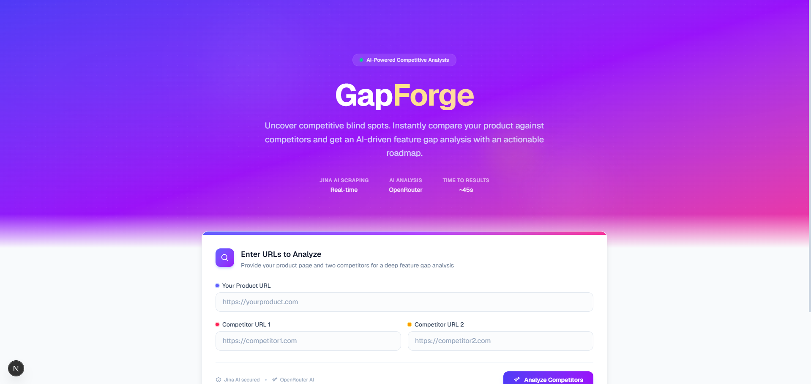
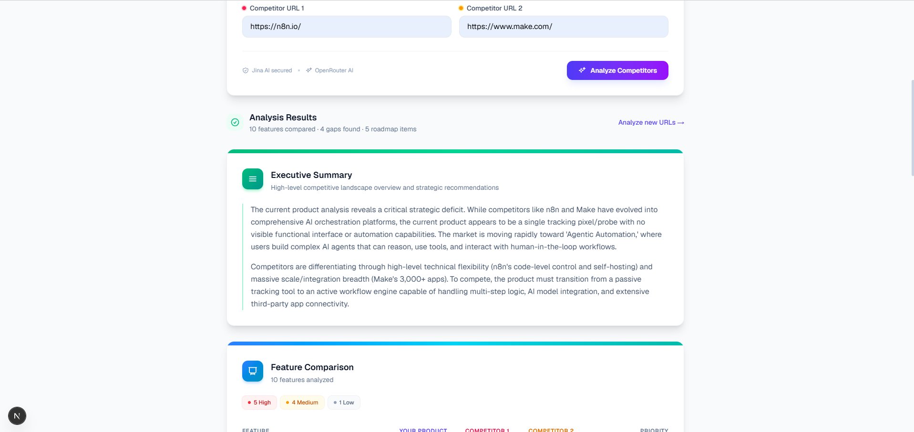
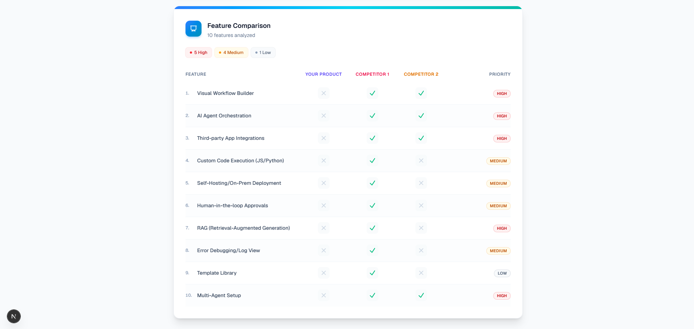
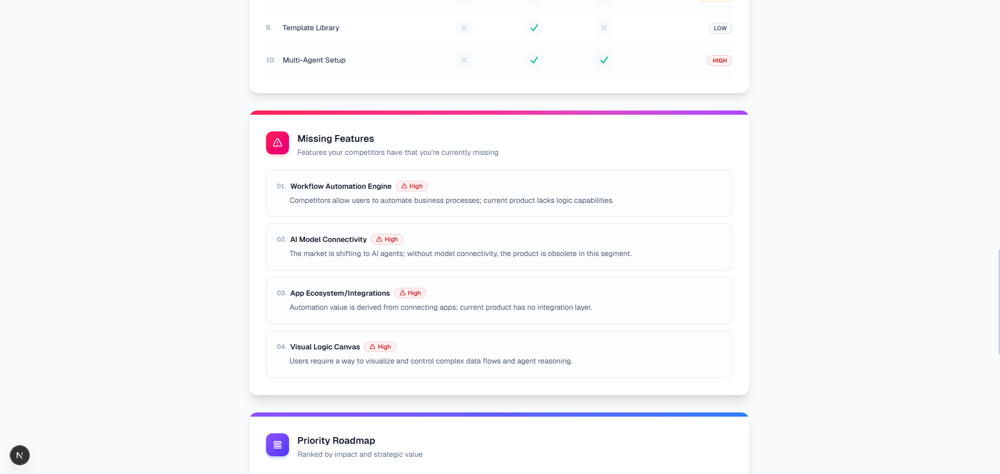
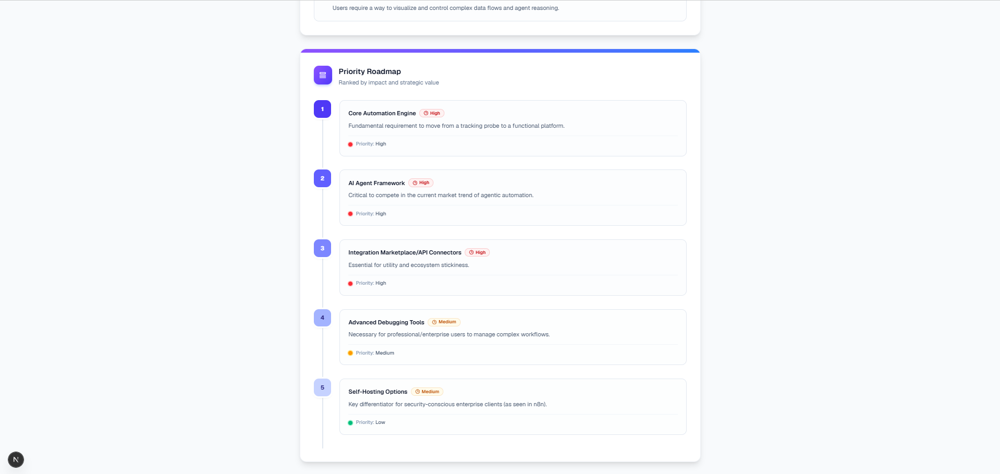
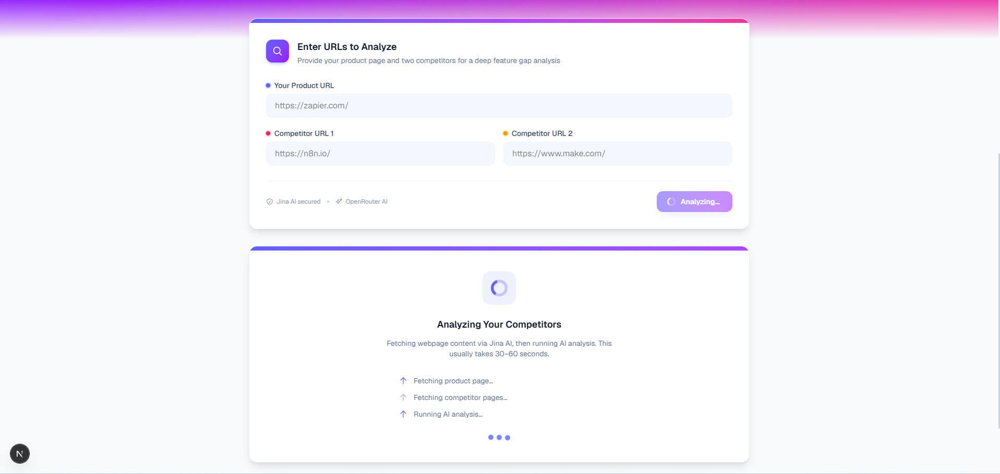

# GapForge

**AI-powered competitive feature gap analysis** — Compare your product against competitors and get a structured, actionable report in seconds.

<p>
  
  
  
  
</p>

---

## Why GapForge?

Product teams spend hours manually stalking competitor landing pages, comparing feature tables, and debating what to build next. GapForge automates the grunt work:

1. Drop in your product URL and 1–2 competitor URLs
2. AI reads the pages and extracts the full feature surface
3. Get a side-by-side comparison matrix, missing-feature hits with impact scores, and a prioritized build roadmap

It's not another analytics dashboard — it's a focused tool that answers one question well: **what should we build to win?**

---

## Features

- **AI-powered competitor analysis** — Compare up to 2 competitors against your product in a single run
- **Feature extraction** — Extracts 10–15 distinct product features from raw marketing pages
- **Feature comparison matrix** — Desktop table and mobile card view showing who owns what
- **Missing feature detection** — Spots what competitors have that you don't, ranked by business impact
- **Priority roadmap generation** — 5-item ranked build plan with effort estimates and priority ratings
- **Executive summary** — One-card strategic overview of the competitive landscape
- **SSRF-safe URL validation** — Every submitted URL is validated against private/internal network ranges before any request is made

---

## Screenshots

| | |
|---|---|
|  |  |
| **Hero + URL input form** | **Executive summary card** |
|  |  |
| **Feature comparison matrix** | **Missing features with impact badges** |
|  |  |
| **Prioritized roadmap timeline** | **Running application** |

---

## Architecture

```
User submits URLs
        │
        ▼
  ┌─────────────────────┐
  │  Next.js API         │  POST /api/analyze
  │  (route.ts)          │  Validates URLs (SSRF check)
  └────────┬────────────┘  Checks API keys
           │
           ▼
  ┌─────────────────────┐
  │  Jina AI Reader      │  Fetches all pages concurrently
  │  (fetchWithJina)     │  Graceful per-URL failure handling
  └────────┬────────────┘
           │
           ▼
  ┌─────────────────────┐
  │  OpenRouter          │  POST /chat/completions
  │  (lib/ai.ts)         │  Model: OPENROUTER_MODEL
  └────────┬────────────┘  System prompt guides JSON output
           │
           ▼
  ┌─────────────────────┐
  │  AI Analysis         │  Returns { summary, features, gaps, roadmap }
  │  (JSON parse)        │  Auto-repair on malformed JSON
  └────────┬────────────┘
           │
           ▼
  ┌─────────────────────┐
  │  Client renders      │  Executive Summary
  │  results in          │  Feature Comparison Table
  │  sections            │  Missing Features
                         │  Prioritized Roadmap
```

---

## Tech Stack

| Layer | Technology |
|---|---|
| Framework | [Next.js](https://nextjs.org/) 16 (App Router) |
| Language | [TypeScript](https://www.typescriptlang.org/) (strict mode) |
| Styling | [Tailwind CSS](https://tailwindcss.com/) v4 |
| AI Provider | [OpenRouter](https://openrouter.ai/) (model-agnostic) |
| Web Scraper | [Jina AI Reader](https://r.jina.ai) |
| Fonts | Geist (via `next/font`) |

---

## Getting Started

### Prerequisites

- Node.js 18+
- An [OpenRouter API key](https://openrouter.ai/keys) (free tier available)

### Installation

```bash
git clone https://github.com/Saitarun29/gapforge.git
cd gapforge
npm install
cp .env.local.example .env.local
```

### Environment Variables

| Variable | Required | Default | Description |
|---|---|---|---|
| `OPENROUTER_API_KEY` | Yes | — | OpenRouter API key ([get one here](https://openrouter.ai/keys)) |
| `OPENROUTER_MODEL` | No | `openrouter/free` | AI model identifier |
| `OPENROUTER_BASE_URL` | No | `https://openrouter.ai/api/v1` | OpenRouter API base URL |

### Run

```bash
npm run dev       # http://localhost:3000
npm run build     # Production build
npm run start     # Run production build
npm run lint      # ESLint
```

---

## Deployment (Vercel)

[](https://vercel.com/new)

1. Push the repository to GitHub
2. Import the project in [Vercel](https://vercel.com/new)
3. Add these environment variables in the Vercel dashboard:
   - `OPENROUTER_API_KEY`
   - `OPENROUTER_MODEL` (optional)
   - `OPENROUTER_BASE_URL` (optional)
4. Deploy

---

## Roadmap

- [ ] **GitHub repository analysis** — Analyze codebases instead of marketing pages
- [ ] **Changelog analysis** — Track feature changes over time from changelogs
- [ ] **Continuous monitoring** — Scheduled re-scraping with alerting on new features
- [ ] **PDF export** — Download analysis results as a PDF report
- [ ] **Team workspaces** — Shared analysis history and collaborative annotations

---

## Contributing

Contributions are welcome. See [CONTRIBUTING.md](CONTRIBUTING.md) for guidelines.

## Changelog

See [CHANGELOG.md](CHANGELOG.md) for version history.

## License

MIT — see [LICENSE](LICENSE) for details.
